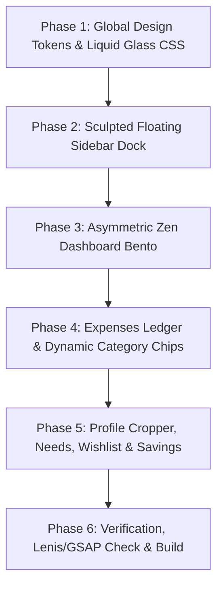

# 🌌 WHALE BUDGETING — GROUND-UP UI/UX OVERHAUL (0 -> 100)
## *Total Anti-AI-Slop Redesign Specification & Architecture*

> **Design Read:**  
> *A high-end Scandinavian-Japanese Zen Luxury Financial Atelier for design-conscious individuals. Combines Apple-grade translucent liquid glass materiality, bespoke editorial typography, cinematic Three.js WebGL spatial immersion, and Lenis momentum physics while preserving the signature sanctuary pastel palette (`#f6dbe2`, `#f6c5c1`, `#c2d772`, `#fffdfa`, `#1a2416`).*

---

## 🎯 1. Mission & Scope: What Changes vs. What Stays

### 🔒 Strictly Preserved (Backend & Architecture)
- **Tech Stack**: Next.js 14 (App Router), React 18, TypeScript, Three.js (`@react-three/fiber`, `@react-three/drei`), GSAP 3.15 + ScrollTrigger, Lenis Smooth Scroll, Tailwind CSS, FontAwesome, MongoDB (Mongoose), Cloudinary, NextAuth.js.
- **Business Logic & Routes**:
  - Monthly Budget Gatekeeper & Live Monitor (`monthlyBudget` in UserProfile).
  - Category structure: Make Up, Skin Care, Jajan, Pakaian (with subcategories: Baju, Celana, Dress, Sepatu), Lainnya.
  - Visual Avatar Pan/Zoom Cropper (`react-easy-crop` + Cloudinary API upload + uppercase initial fallback).
  - Sanctuary modules: Expenses (`/dashboard/expenses`), Needs (`/dashboard/needs`), Wishlist (`/dashboard/wishlist`), Savings (`/dashboard/save`), Profile (`/dashboard/profile`).
  - NextAuth OAuth & Credentials session security.

### 💥 Complete Ground-Up UI/UX Overhaul (Erasing All AI Slop)
- **Erased Forever**:
  - ❌ Harsh 2px black cartoon outlines (`border-2 border-ink`) on cards and buttons.
  - ❌ Generic neo-brutalist sticker drop shadows (`shadow-[0_5px_0_rgba(31,43,24,0.18)]`).
  - ❌ Monotonous 4-card identical metric towers.
  - ❌ Eyebrow label overdose on every section header.
  - ❌ Proportional font jitter on financial numbers.
  - ❌ Flat, sterile solid background boxes.
- **Introduced from Scratch**:
  - ✨ **Liquid Frosted Glass Engine**: Multi-layered `backdrop-blur-3xl`, 1px specular light-refracting edge borders, and organic ambient mesh glow blooms.
  - ✨ **Asymmetric Zen Bento Layout**: Master wealth dial, dual capsule flow chart, dynamic spectrum radial visualizer, and luxury ledger feed.
  - ✨ **Sculpted Floating Sanctuary Dock**: Minimalist sidebar with floating glass capsules, active glow indicators, and collapsible profile drawer.
  - ✨ **Cinematic Motion & Physics**: Lenis inertia scroll, GSAP ScrollTrigger timeline reveals, and spring-based tactile press feedback (`scale(0.98)`).
  - ✨ **Editorial Typography & Tabular Figures**: `Plus Jakarta Sans` with `font-variant-numeric: tabular-nums` and bold integer hierarchy.

---

## 🎨 2. The Luxury Sanctuary Material System

```
┌──────────────────────────────────────────────────────────────────────────────────────────┐
│                                 CANVAS BASE: ALABASTER SILK                              │
│         #fffdfa base with diffused ambient mesh (Rose #f6dbe2 + Peach #f6c5c1 glow)     │
└────────────────────────────────────────────┬─────────────────────────────────────────────┘
                                             │
                       ┌─────────────────────┴─────────────────────┐
                       │                                           │
         ┌─────────────▼─────────────┐               ┌─────────────▼─────────────┐
         │    LIQUID FROSTED GLASS   │               │   SPECULAR LIGHT EDGES    │
         │  • backdrop-blur-3xl      │               │  • 1px solid white/70     │
         │  • rgba(255,255,255,0.75) │               │  • inner highlight inset  │
         │  • 3% SVG micro-grain     │               │  • soft tinted shadows    │
         └───────────────────────────┘               └───────────────────────────┘
```

### Color Palette Token Hierarchy

| Token | Hex Code | Role in Luxury Redesign | Implementation Technique |
|---|---|---|---|
| **Alabaster Canvas** | `#fffdfa` | Master background surface | Warm ivory silk with fixed ambient mesh gradients |
| **Rose Quartz** | `#f6dbe2` | Ambient glow, drawer backdrops, subtle card tints | `rgba(246, 219, 226, 0.55)` with `backdrop-blur-3xl` |
| **Warm Peach** | `#f6c5c1` | Interactive focal points, active state highlights, CTA halo | `rgba(246, 197, 193, 0.85)` + radial light diffusion |
| **Pistachio Sage** | `#c2d772` | Wealth milestones, savings progress, positive cash flow | `#8fa842` text + glowing pill badges |
| **Obsidian Forest Ink** | `#1a2416` | Ultra-crisp, high-contrast typography | Crisp anti-aliased font rendering, zero blur |
| **Subtle Slate Ink** | `#4a5a42` | Secondary metadata, dates, labels | `text-[11px] font-semibold tracking-wide` |

---

## 📐 3. Screen-by-Screen Ground-Up UI Blueprint

```
┌──────────────────────────────────────────────────────────────────────────────────────────┐
│                               MASTER VIEWPORT ARCHITECTURE                               │
├───────────────────────┬──────────────────────────────────────────────────────────────────┤
│                       │  TOP AMBIENT STATUS BAR (Mobile/Tablet Header & Desktop Breadcrumb)│
│   SCULPTED FLOATING   ├──────────────────────────────────────────────────────────────────┤
│    SANCTUARY DOCK     │                                                                  │
│    (Sidebar 72px)     │                     ASYMMETRIC ZEN BENTO GRID                    │
│                       │                                                                  │
│   • Floating Pods     │  ┌───────────────────────────────┐ ┌───────────────────────────┐ │
│   • Active Glow Pill  │  │   MASTER WEALTH AURA DIAL     │ │  SAVINGS & TARGET PODS    │ │
│   • FontAwesome SVG   │  │   • Monthly Pace Halo (75%)   │ │  • Wishlist Progress      │ │
│   • Profile Avatar    │  │   • Large Tabular Budget Rp   │ │  • Emergency Fund Status  │ │
│   • Lang & Theme Pill │  └───────────────────────────────┘ └───────────────────────────┘ │
│                       │  ┌───────────────────────────────┐ ┌───────────────────────────┐ │
│                       │  │   DUAL CAPSULE CASH FLOW      │ │  CATEGORY SPECTRUM RING   │ │
│                       │  │   • Capsule Bar Comparison    │ │  • Multi-Ring Donut Glow  │ │
│                       │  │   • Hover Tooltip Cards       │ │  • Hover Category Pill    │ │
│                       │  └───────────────────────────────┘ └───────────────────────────┘ │
│                       │  ┌─────────────────────────────────────────────────────────────┐ │
│                       │  │                 LIVE CASH FLOW & RECENT LEDGER              │ │
│                       │  └─────────────────────────────────────────────────────────────┘ │
└───────────────────────┴──────────────────────────────────────────────────────────────────┘
```

---

### 3.1 Sculpted Floating Sanctuary Dock (`components/Sidebar.tsx`)
- **Desktop Silhouette**:
  - Suspended floating dock with `rounded-3xl`, soft outer specular glow, and `backdrop-blur-3xl`.
  - Subtle frosted gradient: `bg-gradient-to-b from-[#f6dbe2]/90 via-[#f6c5c1]/45 to-[#f6dbe2]/95`.
  - Border: 1px specular white edge (`border border-white/70 shadow-[0_20px_60px_rgba(246,219,226,0.35)]`).
- **Brand Emblem**:
  - Minimalist Zen Whale icon nestled in a soft frosted squircle with gentle floating animation.
  - Typography: "WHALE BUDGET" in wide letter-spacing (`tracking-[0.25em] text-xs font-black text-[#1a2416]`).
- **Navigation Links**:
  - Active Item: Floating white enamel capsule (`bg-white/95 text-[#1a2416] shadow-sm border border-white translate-x-1.5 font-bold`).
  - Inactive Items: Smooth translucent hover lift with high-contrast FontAwesome SVG glyphs.
  - Micro-Badges: Minimalist pill badges in soft cream (`bg-[#fff9e6] text-[#4a5a42] text-[9px] font-bold`).
- **Bottom Profile & Utility Cluster**:
  - User avatar capsule with gold/sage live status aura, linking directly to `/dashboard/profile`.
  - Floating pill toggles for Language (ID/EN) and Theme (☀️/🌙) with spring-loaded physical micro-press.
  - Minimalist Sign Out button with soft coral tint.

---

### 3.2 Dashboard Sanctuary Overview (`components/DashboardView.tsx`)

#### A. Asymmetric Hero Greeting Banner
- **Greeting Card**:
  - Floating frosted alabaster card with live pulse indicator: `"Sanctuary Aktif · Keuangan Sehat ✨"`.
  - Large display greeting: `"Halo, [Nama Pengguna]!"` in `text-3xl font-extrabold text-[#1a2416]`.
  - Real-time monthly pace badge: `"Sisa Anggaran: Rp xx.xxx (Rp xx.xxx/hari)"`.

#### B. Asymmetric Bento Grid Suite
1. **Master Wealth Halo Card (Primary Col-span-6 / 2 Rows)**:
   - Dynamic SVG circular progress dial displaying remaining monthly budget vs. total expenses.
   - Large display typography (`text-3xl sm:text-4xl tabular-nums font-black text-[#1a2416]`).
   - Daily spending pace indicator with color-coded safety halo (Green = safe, Peach = warning, Coral = critical).
2. **Savings & Dana Darurat Pod (Col-span-3)**:
   - Soft Sage frosted pod with piggy bank icon, total savings balance, and milestone percentage.
3. **Wishlist Target Tracker (Col-span-3)**:
   - Soft Peach pod with star glyph, current savings progress bar, and next target item snippet.
4. **Kebutuhan Pokok Health Pod (Col-span-6)**:
   - Intelligent stock inventory summary showing replenished vs. depleted essentials.

#### C. Analytics & Visualizations Suite
1. **Tren Pengeluaran vs Tabungan (Dual Capsule Bar Chart)**:
   - Rounded capsule pill bars (`rounded-full`) with smooth vertical grow animation on viewport entry.
   - Interactive hover spotlight tooltips showing exact expense & savings breakdown.
   - Subtle background gridlines with soft opacity (`border-ink/5`).
2. **Distribusi Kategori Pengeluaran (Bespoke Glowing Donut Visualizer)**:
   - Multi-layer SVG donut with interactive slice expansion on hover.
   - Center summary showing category breakdown, percentage, and total allocation.
   - 2-column interactive legend cards with color dot indicators.

#### D. Live Cash Flow Ledger
- Refined list items with division icon badges (Make Up, Skin Care, Jajan, Pakaian, Lainnya).
- Clean currency formatting with red expense indicator (`- Rp xx.xxx`).
- Direct action link to full expense log.

---

### 3.3 Expense Management & Budget Gatekeeper (`app/dashboard/expenses/page.tsx`)
- **Monthly Budget Gatekeeper Card**:
  - Prominent setup modal if budget is not set, or sleek top-bar monitor with remaining days & daily allowance indicator.
- **Transaction Input Form**:
  - Modern floating input fields with high-contrast labels and focus rings.
  - Interactive category selector chips with dynamic subcategory expansion for **Pakaian** (Baju, Celana, Dress, Sepatu).
  - Optional merchant/receipt URL input with auto-validation.
- **Filtered Expense Table / Card Stream**:
  - Category pill filter bar with item counts.
  - Search bar with live debounce.
  - Individual expense cards with smooth hover lift, tag chips, and inline edit/delete actions.

---

### 3.4 Profile & Media Management (`app/dashboard/profile/page.tsx`)
- **Visual Avatar Cropper**:
  - Circular crop preview using `react-easy-crop` with zoom & rotation sliders.
  - Direct Cloudinary synchronization with MongoDB user profile fallback.
- **Account Identity Fields**:
  - Display Name, Motto / Financial Goal, Monthly Budget Limit input.
  - High-contrast toast notification feedback on save.

---

### 3.5 Supplementary Sanctuary Modules
- **Kebutuhan Pokok (`/dashboard/needs`)**: Auto-stock toggle cards, inventory depletion alerts.
- **Wishlist Planner (`/dashboard/wishlist`)**: Visual target progress bars, priority ranking, purchase completion celebrations.
- **Nabung & Dana Darurat (`/dashboard/save`)**: Virtual piggy bank canisters, milestone tracking.

---

## 🛠️ 4. Phased Step-by-Step Execution Plan



### Phase 1: Global Design Tokens & Liquid Glass CSS
- Update `tailwind.config.ts` and `app/globals.css` with specular glass utility classes, ambient mesh backgrounds, and tabular number helpers.
- Remove all cartoonish `border-2 border-ink` and sticker shadows.

### Phase 2: Sculpted Floating Sidebar Dock
- Rebuild `components/Sidebar.tsx` as a floating frosted glass sanctuary dock with responsive mobile drawer and FontAwesome iconography.

### Phase 3: Asymmetric Zen Dashboard Bento
- Rebuild `components/DashboardView.tsx` with master wealth aura dial, capsule flow charts, multi-ring donut visualizer, and clean transaction stream.

### Phase 4: Expenses Ledger & Dynamic Category Chips
- Rebuild `app/dashboard/expenses/page.tsx` with live budget monitor, dynamic subcategory chips (Baju, Celana, Dress, Sepatu), and receipt links.

### Phase 5: Profile Cropper & Sanctuary Modules
- Rebuild `app/dashboard/profile/page.tsx`, `needs`, `wishlist`, and `save` views with the new frosted glass language.

### Phase 6: Verification & Production Build
- Verify zero layout shift, responsive mobile viewports, WCAG AA color contrast, and execute `npm run build`.

